[TOC]

## 00_通配选择器

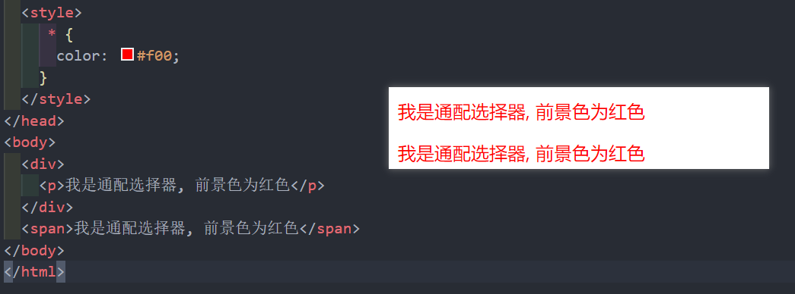

* **'*'**

## 01_元素选择器

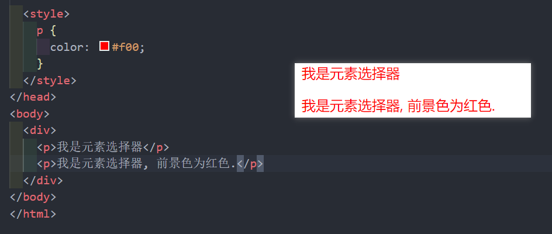

## 02_类选择器

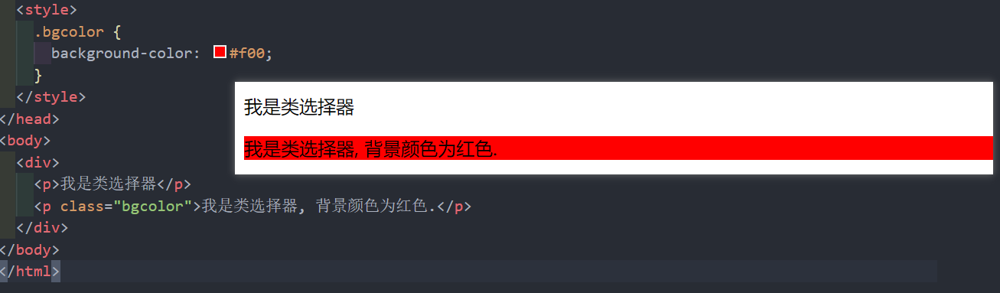

* **'.'  'class'**

## 03_id选择器

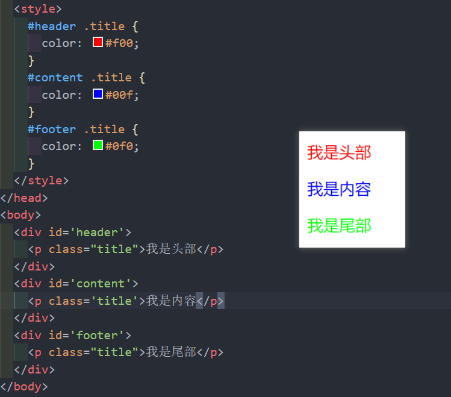

* **'#'**

* 本质上是后代选择器

* 常用于给类选择器相同的元素增加属性

## 04_属性选择器

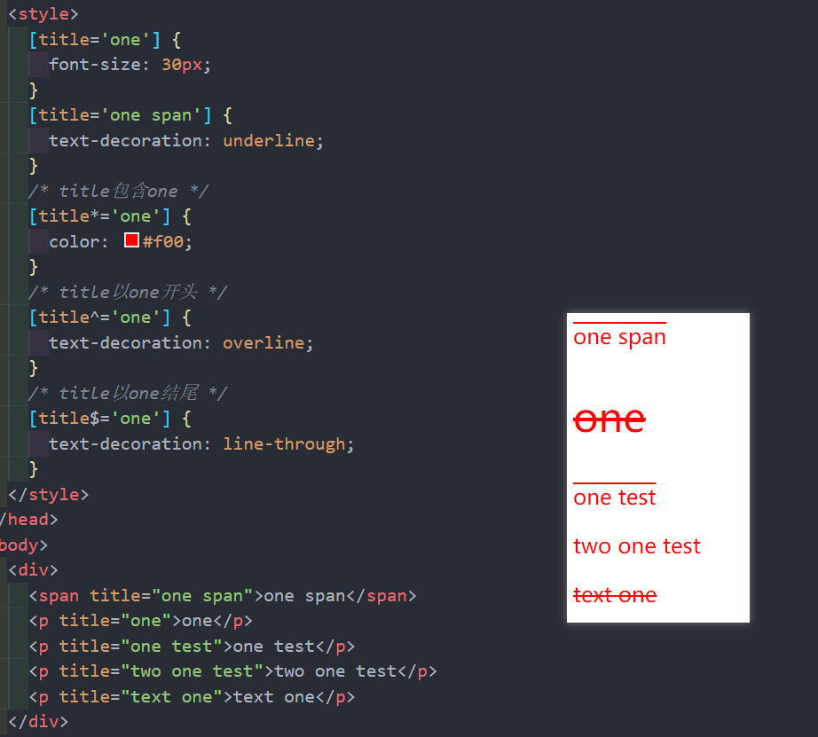

* **'[]'**

## 05_后代选择器

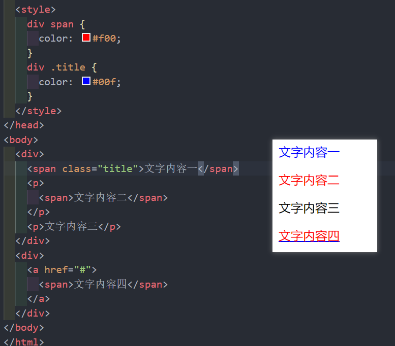

* 属性之间用**空格**隔开
* 直接和间接子元素均继承属性

## 06_子代选择器

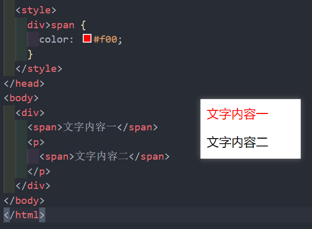

* **'>'**
* 直接子元素才能继承属性

## 07_相邻兄弟选择器

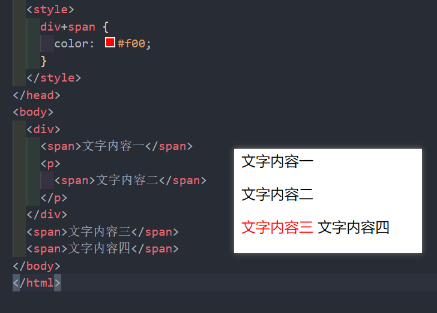

* **'+'**
* div 后面紧挨着的 span 元素, 且必须是兄弟关系

## 08_全兄弟选择器

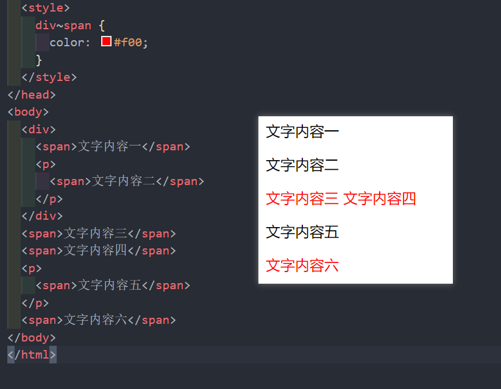

* **'~'**
* 所有和 div 同级 span 元素

## 09_交集选择器

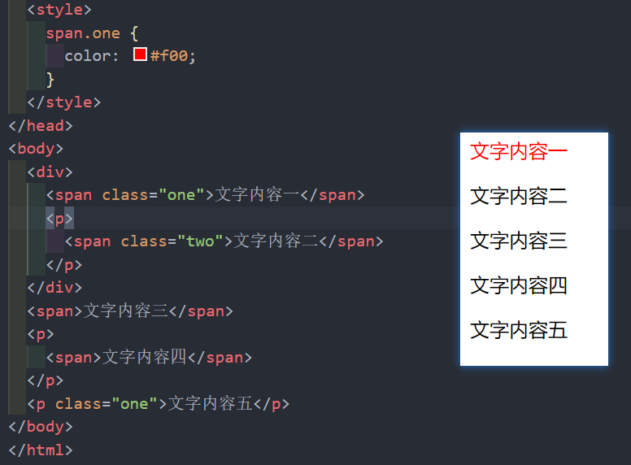

* 相邻属性直接无需空格

## 10_并集选择器

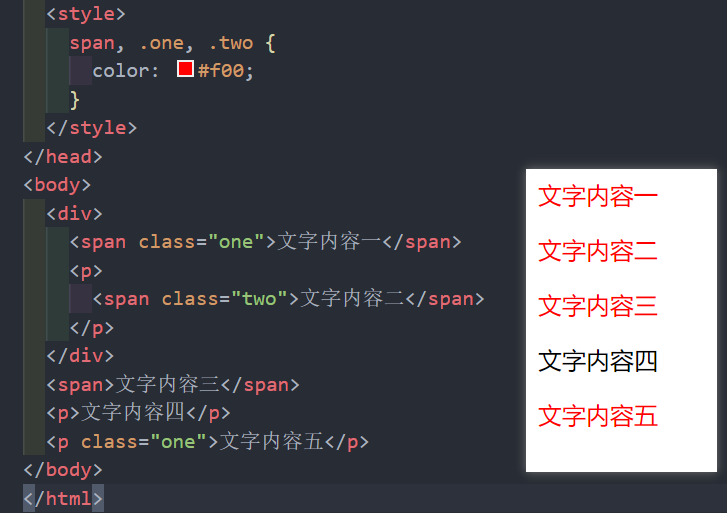

* 用 **','** 隔开
