[TOC]

## 01_动态伪类

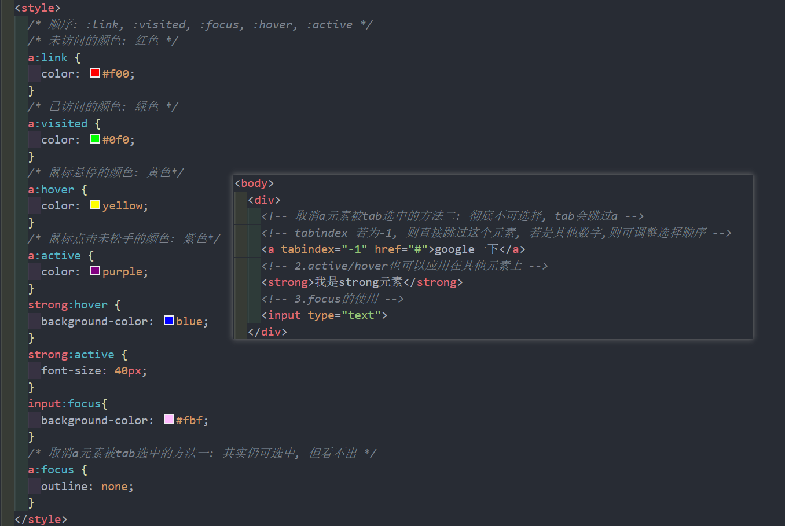

### :link, :visited, :hover, :active 应用于 a 元素

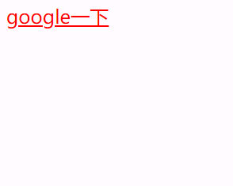

### :hover, :active 应用于其他元素

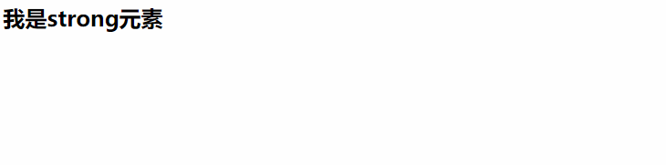

### :focus 使用

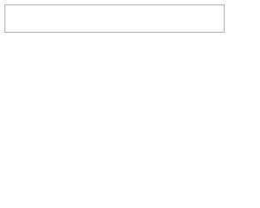

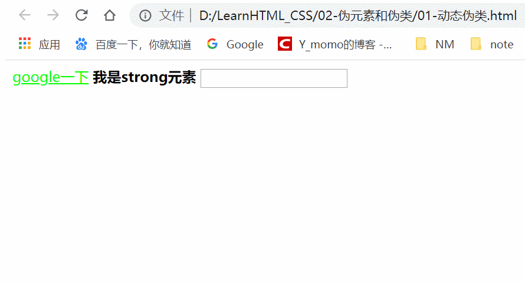

## 02_目标伪类

### :target

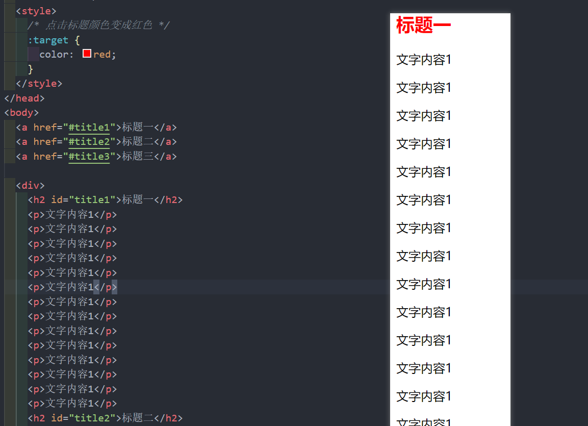

## 03_语言伪类

### :lang()

## 04_元素状态伪类

### :enabled, :disabled, :checked

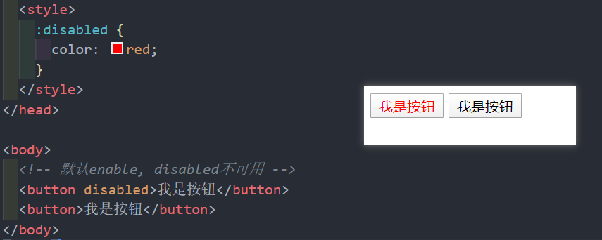

## 05_结构伪类

### :nth-child()

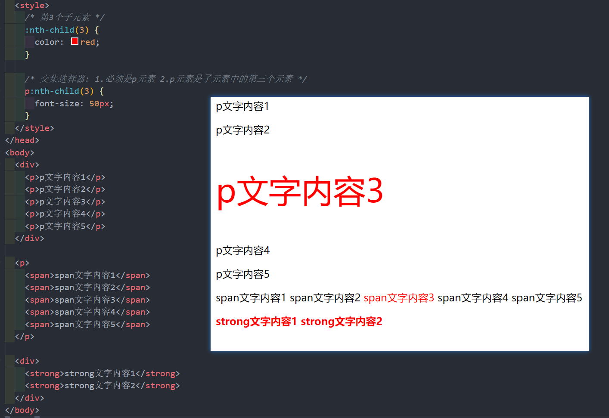

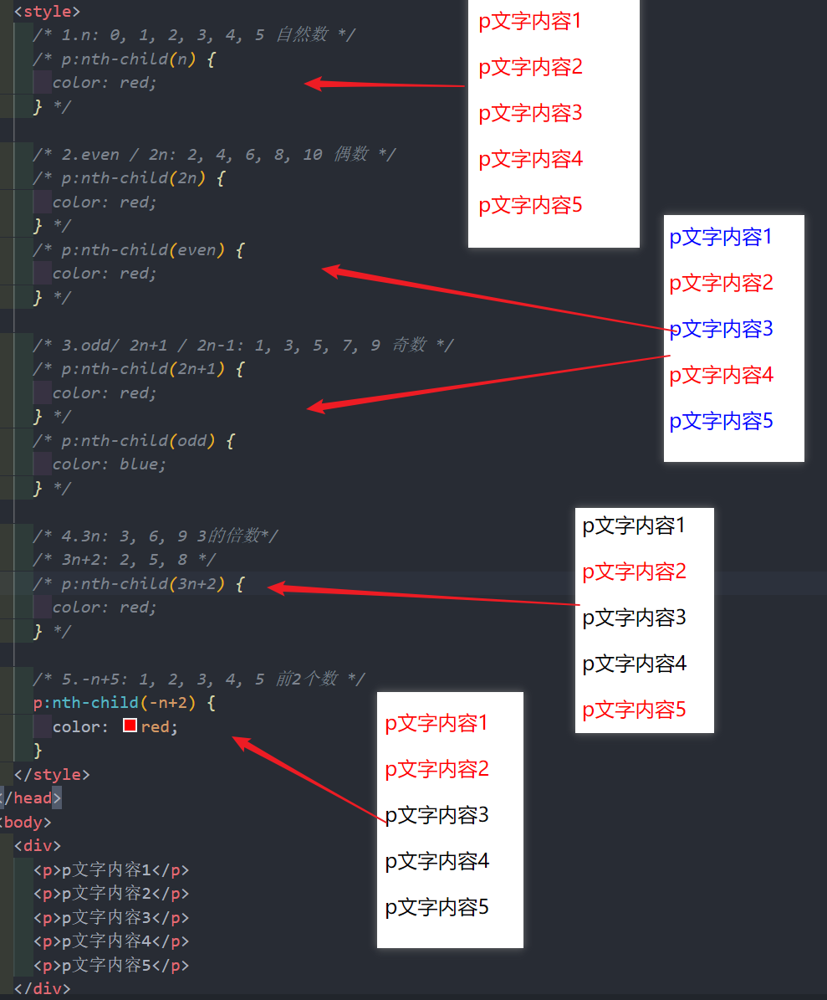

###  :nth-last-child()

* 选中倒数的元素, 其余和nth-child()相同

### :nth-of-type()

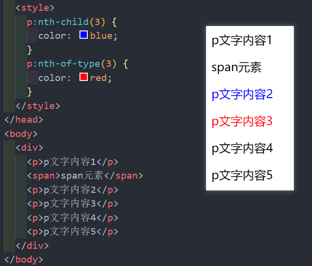

### :nth-last-of-type()

* 选中倒数的元素, 其余和nth-of-type()相同

### :first-child, :last-child, :first-of-type, :last-of-type

* :first-child == nth-child(1)
* :last-child == nth-last-child(1) 
* :first-of-type == nth-of-type(1)
* :last-of-type == nth-last-of-type(1)

### :only-child, :only-of-type

* :only-child, 父元素中的唯一子元素
* :only-of-type, 父元素中同类型的唯一子元素

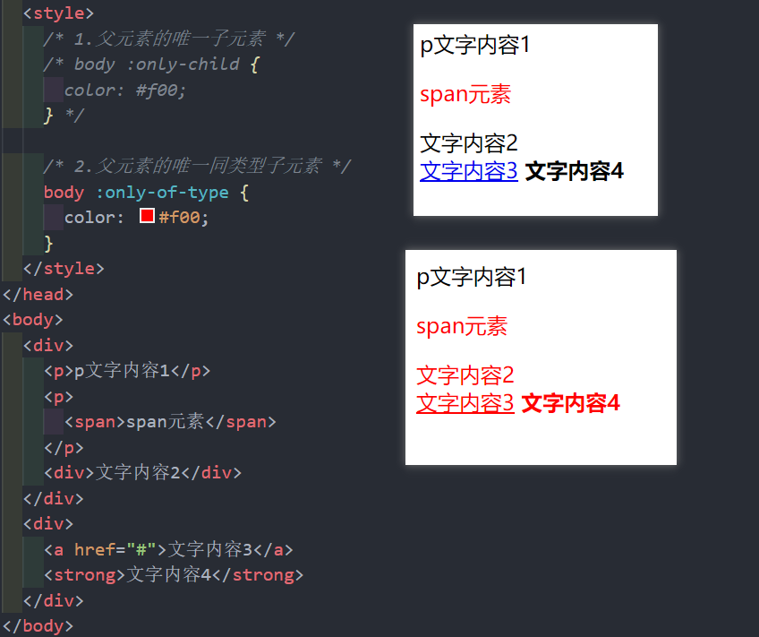

### :root

* :root == html , 根元素,  即 HTML 元素

###  :empty

* 元素内容为空

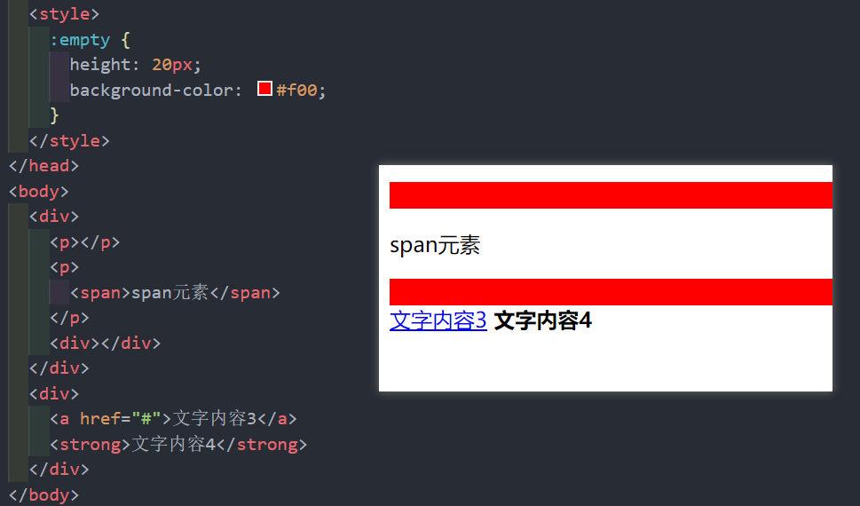

## 06_否定伪类

### :not()

* :not(x) 除 x 之外其他元素都拥有属性, x 可以是简单选择器或者伪类

