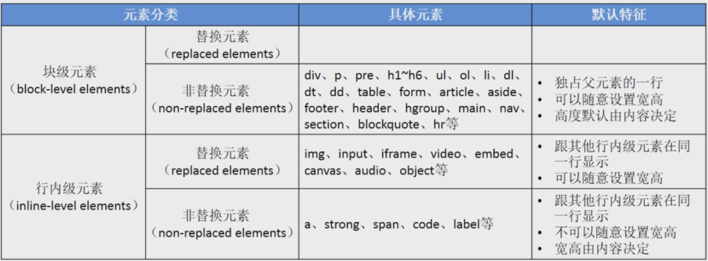

# 内容概述

## 一、元素类型

### 1.1 元素的显示类型划分

#### 1) 块级元素(block-level elements)

* 独占父元素的一行
* div - p
* 可以设置宽高
* 高度默认由内容决定

#### 2) 行内级元素(inline-level elements)

* 和其他元素可以在同一显示
* span - strong - img - input - iframe

### 1.2 元素的内容类型划分

#### 1) 替换元素(replaced elements)

* 元素本身没有内容, 浏览器根据元素的类型和属性, 来决定元素的具体显示内容
* img - iframe
* 替换元素都是行内元素
* 可以设置宽高

#### 2) 非替换元素(non-replaced elements)

* 和替换元素相反, 元素本身是有实际内容的, 浏览器会直接将内容显示出来, 而不需要根据元素类型和属性来判断到底显示什么内容
* 不可随意设置宽高
* 宽高由内容决定

### 1.3 display

* inline
  * 让元素显示为行内级元素
* block
  * 让元素显示为块级元素
* none
  * 让元素隐藏，不占空间
  * visibility: hidden 隐藏元素, 占据空间
* inline-block
  * 让元素同时具备行内级、块级元素特征
  * 可以和其他元素在同一行显示
  * 可以设置宽高

### 1.4 visibility

* visible: 默认值, 显示内容
* hidden: 隐藏元素, 但是占据空间

### 1.5 overflow

* 用于控制内容溢出时的行为
  * visible: 溢出的内容照样可见, 是默认值
  * hidden: 溢出的内容直接裁剪
  * scroll: 溢出的内容被裁剪, 但可以通过滚动机制查看
    * 会一直显示滚动条区域, 滚动条区域占据的空间属于 width height
  * auto: 自动根据内容是否溢出决定是否提供滚动机制
* overflow-x 分别设置水平方向
* overflow-y 分别设置垂直方向

### 1.6 元素之间的空格

* 行内级元素(包括 inline-block 元素)的代码之间如果有空格, 会被解析成空格
* 目前的解决方法
  * 元素代码之间不要留空格
  * 注释掉空格
  * 设置父元素的font-size为0, 然后在元素中重新设置自己需要的font-size
    * 此方法在 Safari 中不适用
  * 给元素加float

### 1.7 元素之间的嵌套关系

* 块级元素、inline-block元素
  * 一般情况下, 可以包含其他元素(比如块级元素、行内元素、inline-block元素)
  * 特殊情况, p元素不能包含其他块级元素
* 行内元素(如span/a/strong等)
  * 一般情况下, 只能包含行内元素