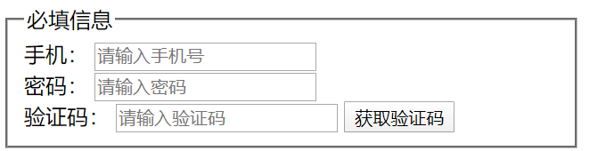
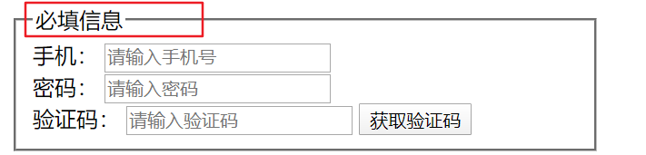
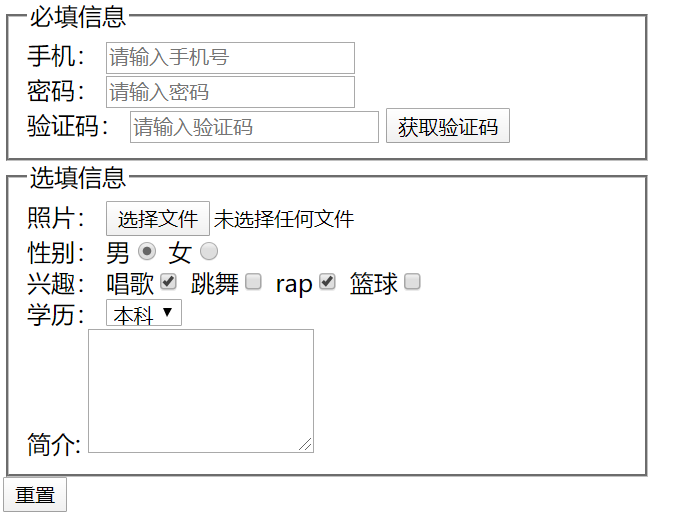
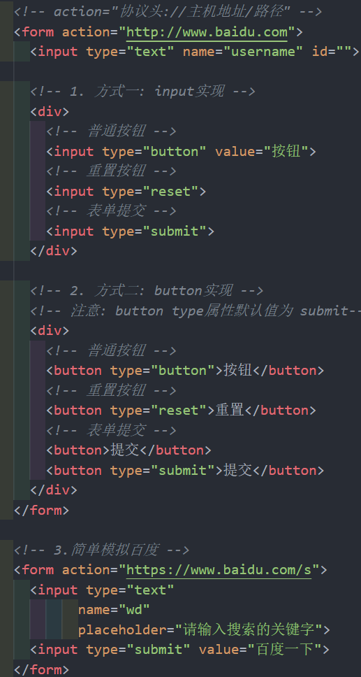
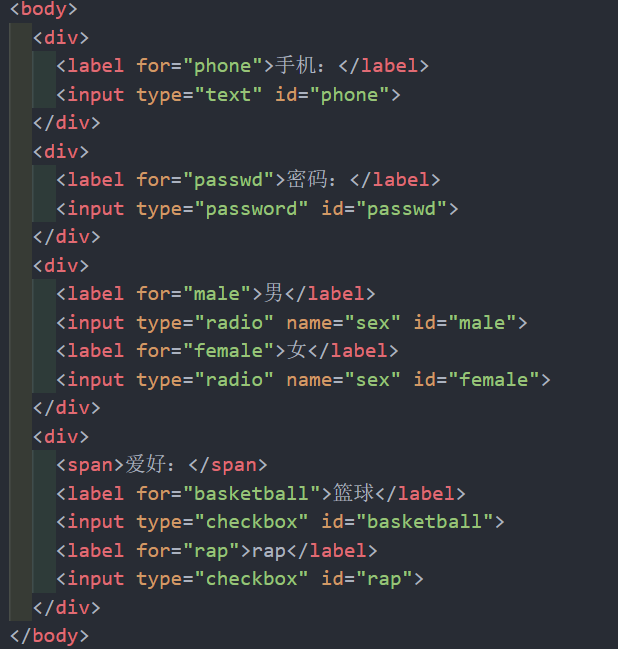
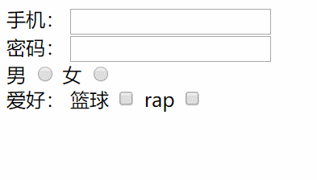
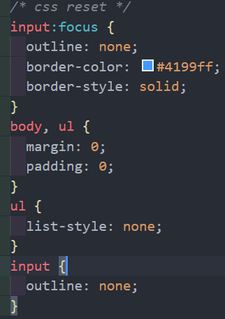

# 内容概述

## 一、HTML-表单元素

### 1.1 input的属性(type, maxlength, placeholder)

* type
  * text
    * 明文形式
  * password
    * 密文形式
  * file
    * 文件上传
  * button
    * 按钮
  * radio
    * 单选框
    * name 需要相同
  * checkbox
    * 多选框
* select
  * 下拉选择
  * size 
    * 显示多少项
  * multiple
    * 可以多选
* option
  * selected
    * 默认被选中
* maxlength
  * 允许输入的最大长度
* name
  * 上传数据到服务器的key
* value
  * 上传数据到服务器的value
* placeholder
  * 默认显示的文字

* textarea

  * cols
    * 列数
  * rows
    * 行数
  * resize
    * none 禁止缩放
    * horizontal 水平缩放
    * vertical 垂直缩放
    * both(默认值) 水平垂直缩放

  

### 1.2 input的布尔属性(checked, selected)

* readonly
  * 只读(不常用)
* disabled
  * 禁用
* checked
  * 默认选中
  * 只能用于radio单选框和checkbox多选框
* autofocus
  * 页面打开后默认聚焦
  * 常用于第一个输入框
* selected
  * 默认选中
  * 用于option下拉选择
* multiple
  * 多选(少用)

### 1.3 fieldset - legend

### 1.4 按钮的实现方式

### 1.5 input和label的关系

### 1.6 CSS reset(outline:none)

### 1.7 表单提交

* 传统的表单提交
  * 将所有的input包裹到一个form中
  * form设置action(服务器地址)
  * input/button类型是submit
  * 点击submit, 自动将所有的数据提交到服务器
  * 弊端1
    * 会进行页面的跳转(意味着服务器必须有写好的一个页面, 返回给前端, 前端直接展示这个页面)
    * 服务器提交将页面写好: 服务端渲染(利于SEO优化)
  * 弊端2
    * 不方便进行表单数据的验证
* 前后端分离
  * 通过JavaScript获取到所有表单内容
  * 通过正则表达式进行表单的验证
  * 发送ajax请求, 将数据发送给服务器
  * 服务器会返回结果, 需要前端解析这个数据, 并且决定显示什么内容(前端渲染和前端路由)

### 1.8 form的常用属性

* action
  * 用于提交表单数据的请求url
* method
  * 请求方法(GET和POST), 默认是GET
* target
  * 在什么地方打开URL(参考a元素的target)
* accept-charset
  * 默认是 unknown
* enctype
  * input type有一个file类型时, 需要设置成 multipart/form-data

## 二、元素类型

### 1.1 元素的显示类型划分

#### 1) 块级元素(block-level elements)

* 独占父元素的一行
* div - p
* 可以设置宽高
* 高度默认由内容决定

#### 2) 行内级元素(inline-level elements)

* 和其他元素可以在同一显示
* span - strong - img - input - iframe

### 1.2 元素的内容类型划分

#### 1) 替换元素(replaced elements)

* 元素本身没有内容, 浏览器根据元素的类型和属性, 来决定元素的具体显示内容
* img - iframe
* 替换元素都是行内元素
* 可以设置宽高

#### 2) 非替换元素(non-replaced elements)

* 和替换元素相反, 元素本身是有实际内容的, 浏览器会直接将内容显示出来, 而不需要根据元素类型和属性来判断到底显示什么内容
* 不可随意设置宽高
* 宽高由内容决定

### 1.3 display

* inline
  * 让元素显示为行内级元素
* block
  * 让元素显示为块级元素
* none
  * 让元素隐藏，不占空间
* inline-block
  * 让元素同时具备行内级、块级元素特征
  * 可以和其他元素在同一行显示
  * 可以设置宽高