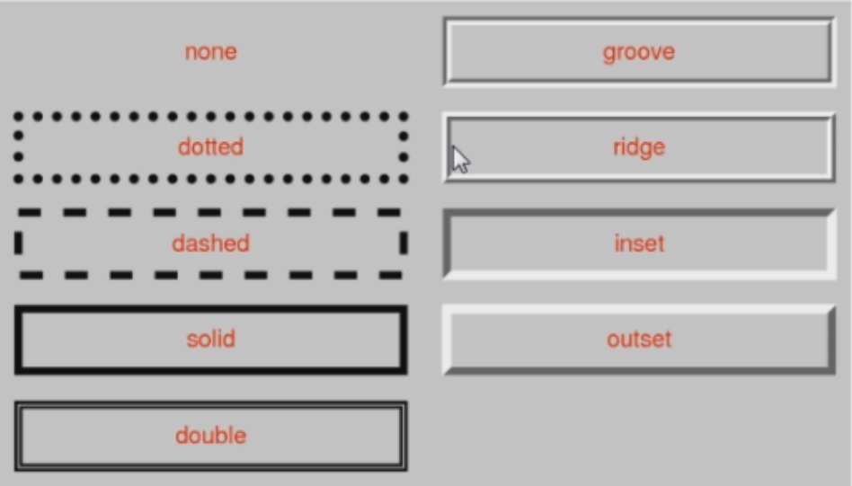

# 内容概述

## 一、盒子模型

* content(内容)
* padding(内边距)
* border(边框)
* margin(外边距)

### 1.1 content 相关属性

* width 宽度
* min-width 最小宽度
  * 无论内容多少, 宽度都大于或等于 min-width
* max-width 最大宽度
  * 无论内容多少, 宽度都小于或等于 min-width
* height 高度
* min-height 最小高度
* max-height 最大高度

###  1.2 padding 相关属性

* top-right-bottom-left 顺时针
* padding 是 padding-top padding-right padding-bottom padding-left 的缩写属性
  * 三个值: 上和右和下, 左跟随右
  * 两个值: 上和右, 下跟随上, 左跟随右
  * 一个值: 上右下左使用同一个值

### 1.3 margin 相关属性

* 和 padding 相同
* 折叠问题(只针对上下, 左右不会折叠)
* margin属性一般用于兄弟元素, padding属性一般用于父子元素

#### 1.3.1 上下margin传递

* margin-top 传递
  * 如果**块级**元素的**顶部线**和父元素的顶部线重叠, 那么这个块级元素的margin-top值会传递给父元素
* margin-bottom 传递
  * 如果块级元素的底部线和父元素的底部线重叠,  并且父元素的高度是auto, 那么这个块级元素的margin-bottom值会传递给父元素
* 如何防止出现传递问题?
  * 给父元素设置padding-top/padding-bottom
  * 给父元素设置border
  * 触发BFC(block format context) -- 最有效的方法
    * 结界
    * 如何触发BFC?
      * 浮动float
      * 设置一个元素的overflow为非visible
        * hidden
        * scroll
        * auto

#### 1.3.2 上下margin折叠

* 垂直方向上相邻的2个margin(margin-top/marginbottom)有可能会合并为1个margin, 这种现象叫做collapse(折叠)
* 水平方向上的margin(margin-left/margin-right)不会collapse
* 折叠后最终值的计算规则
  * 取margin-top/marginbottom的最大值
* 如何防止margin collapse?
  * 只设置其中一个元素的margin

### 1.4 border相关属性

* 边框宽度
  * border-top-width/border-right-width/border-bottom-width/border-left-width
  * border-width是简写属性
* 边框颜色
  * border-top-color/border-right-color/border-bottom-color/border-left-color
  * border-color是简写属性
* 边框样式
  * border-top-style/border-right-style/border-bottom-style/border-left-style
  * border-style是简写属性

* border: 宽度 样式 颜色(不区分顺序)
* border-\*-\*-radius 针对四个角分别设置
  * 两个值: border-top-left-radius: 水平半径 垂直半径
  * 一个值: 水平和垂直方向半径值一样
  * border-radius 是缩写属性(顺时针方向)
  * 设置百分比
    * 参考的是当前元素的显示宽度(border+padding+width)
    * 50%是圆形

### 1.5 行内非替换元素的注意点

* 以下属性对行内非替换元素不起作用
  * width height margin-top margin-bottom
* 以下属性对行内非替换元素比较特殊
  * padding-top padding-bottom 上下方向的border

### 1.6 outline

* outline 表示元素的外轮廓
  * 不占用空间
  * 默认显示在border的外面
* 相关属性（和border类似）
  * outline-width
  * outline-style
  * outline-color
  * outline 简写属性
* 应用实例
  * 去除a元素/input元素的focus轮廓效果

### 1.7 shadow

#### 1) box-shadow

* box-shadow属性可以设置一个或者多个阴影
  * 每个阴影用\<shadow>表示
  * 多个阴影之间用逗号隔开, 从前往后叠加
  * \<shadow-b>的常见格式
    * \<shadow-b> = inset? && \<length>{2, 4} && \<color>?
    * 第一个\<length>:  水平方向的偏移, 正数向右偏移
    * 第二个\<length>:  垂直方向的偏移, 正数向下偏移
    * 第三个\<length>:  模糊半径(blur radius)
    * 第四个\<length>:  延伸距离(四周延伸)
    * \<color>:  阴影的颜色, 如果没有设置, 就跟随color属性的颜色
    * inset:  外框阴影变成内框阴影

#### 2) text-shadow

* 用法类似于box-shadow, 用于给文字添加阴影效果
* text-shadow同样适用于::first-line, ::first-letter
* \<shadow-b>的常见格式
  * \<shadow-t> = \<length>{2, 3} && \<color>?

### 1.8 box-sizing

* box-sizing: content-box   **W3C标准盒子模型**
  * 设置宽度和高度时只是指定内容的宽高
* boxsizing: border-box     **IE盒子模型(IE8以下浏览器)**
  * 设置宽度和高度时是 内容+内边距+边框 的宽高

### 1.9 元素的水平居中

* text-align: center
  * 普通文本
  * 行内元素
  * 行内替换元素(img/input)
  * 行内块级元素(inline-block)
* margin: 0 auto + text-align: center
  * 块级元素

