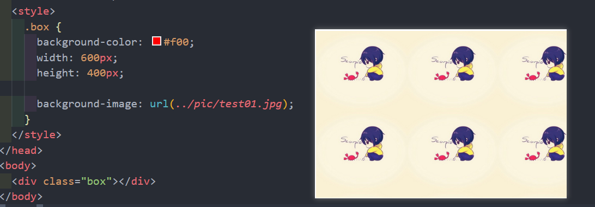
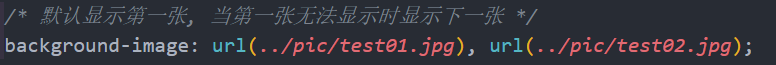
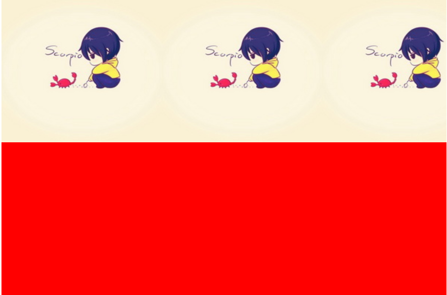
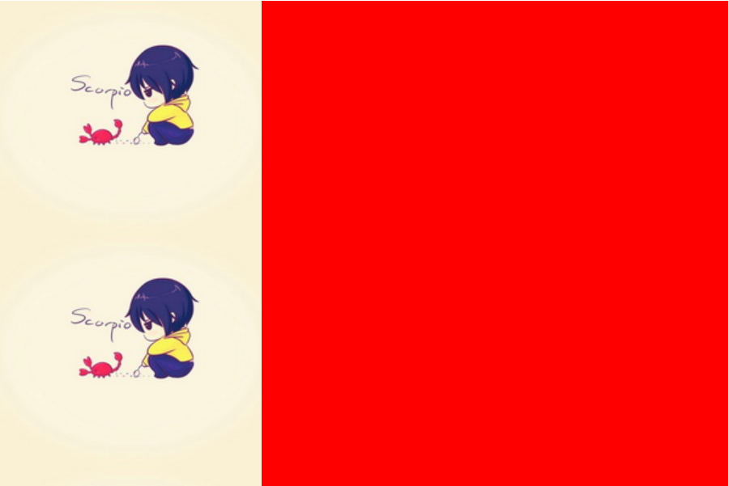
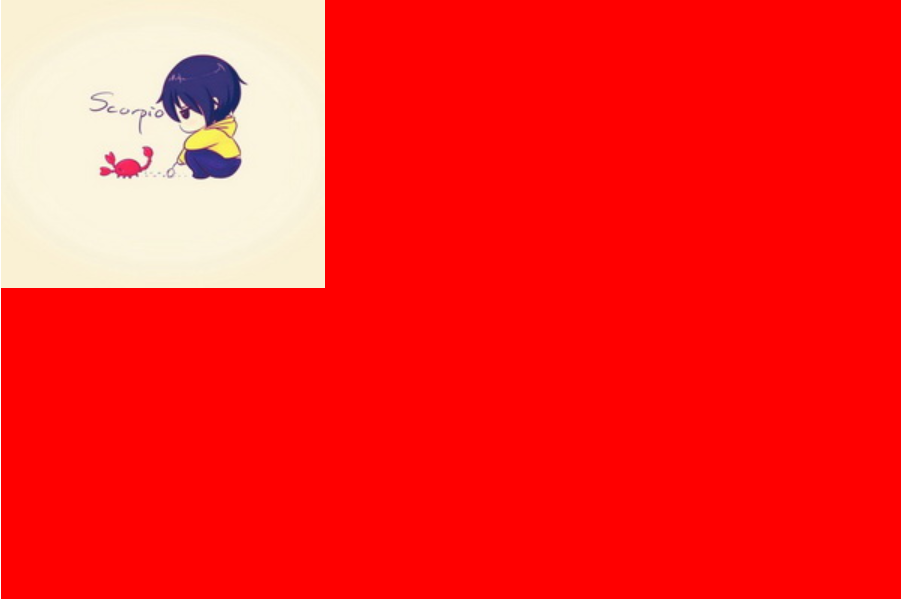
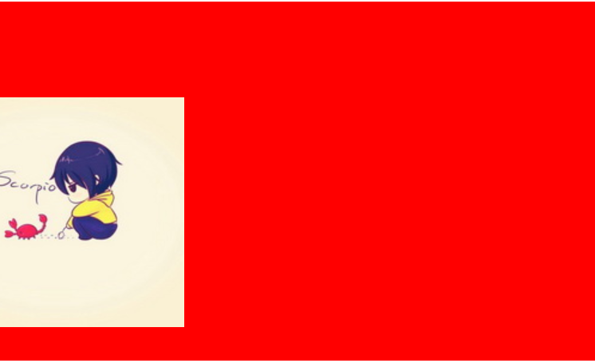

# 内容概述

## 一、背景设置

### 1.1 background-image

* 会盖在background-color上面, 不是覆盖

* 如果设置了多张图片
  * 设置的第一张图片将显示在最上面, 其他图片按顺序层叠在下面

* 如果设置了背景图片后, 元素没有具体的宽高, 背景图片是不会显示出来的

### 1.2 background-repeat

* background-repeat: repeat (默认)
* background-repeat: repeat-x
  * 向水平方向平铺

* background-repeat: repeat-y
  * 向垂直方向平铺

* background-repeat: no-repeat

### 1.3 background-size

* background-repeat: no-repeat;
* auto: 以背景图本身大小显示
* cover: 缩放背景图, 以完全覆盖铺满元素
* contain: 缩放背景图, 宽度或者高度铺满元素, 但是图片保持宽高比
* \<percentage>: 百分比, 相对于背景区(background positioning area)
  * background-size: 30% 
    * 相对于背景区宽度的30%, 高度根据原来宽高比自动计算
  * background-size: 30% 50%
    * 相对于背景区宽度的30%, 高度的50%
* length: 具体的大小
  * background-size: 100px
    * 设置图片宽度100px, 高度根据原来宽高比自动计算
  * background-size: 100px 100px
    * 设置图片宽度100px, 高度100px

### 1.4 background-position

* 用于设置背景图片在水平、垂直方向的具体位置
* background-position: -30px 80px
  * 按照坐标轴偏移, 超出部分被隐藏

* background-position: \<left/center/right> \<top/center/bottom>
* 如果只设置了一个方向, 另一个方向默认是center

* 浏览器适配背景居中: background-position: center -81px