### 内容概述

## 一、定位

### 1.1 标准流(Normal Flow)

* 默认情况下, 元素都是按照 normal flow (标准流/常规流/正常流/文档流[document flow]) 进行排布
  * 从左到右, 从上到下按顺序摆放好
  * 默认情况下, 互相之间不存在层叠现象

### 1.2  margin、padding 实现定位

* 在标准流中, 可以使用margin/padding对元素进行定位
  * 其中margin还可以设置负数
* 比较明显的缺点是
  * 设置一个元素的margin/padding, 通常会影响到标准流中其他元素的定位效果
  * 不便于实现元素层叠的效果

### 1.3 position

#### 1) static - 静态定位

* position 属性的默认值
* 元素按照normal flow布局
* left/right/top/bottom 不起作用 

#### 2) relative - 相对定位

* 元素按照 normal flow 布局
* 可以通过left/right/top/bottom进行定位
  * 定位参照对象是元素自己原来的位置
* 相对定位的应用场景
  * 在不影响其他元素位置的前提下, 对当前元素位置进行微调

#### 3) fixed - 固定定位

* 元素脱离normal flow(脱离标准流/脱标)
* 可以通过left/right/top/bottom进行定位
  * 定位参照对象是视口(viewport)
* 当画布滚动时, 固定不动

#### 4) absolute - 绝对定位

* 元素脱离normal flow(脱离标准流/脱标)
* 可以通过left/right/top/bottom进行定位
  * 定位参照对象是最临近的定位祖先元素(relative/absolute/fixed)
  * 如果找不到这样的祖先元素, 参照对象是视口(viewport)
* 定位元素
  * position: relative
  * position: absolute
  * position: fixed

### 1.4 脱标元素的特点

* 可以随意设置宽高
* 宽高默认由内容决定
* 不再受标准流的约束
* 不再给父元素汇报宽高数据
* display position float 之间的关系
  * 如果display为none, 则position/float不生效
  * 如果position: absolute/fixed 或者 float: left/right 时, display 根据下表

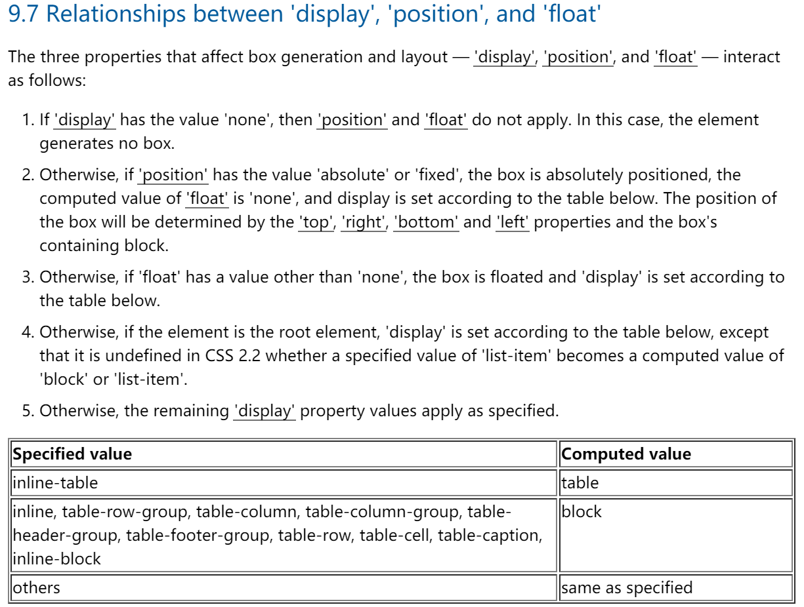

### 1.5 子绝父相

* 在绝大多数情况下, 子元素的绝对定位都是相对于父元素进行定位
* 如果希望子元素相对于父元素进行定位,  又不希望父元素脱标, 常用的解决方案是:
  * 父元素设置 position: relative (让父元素称为定位元素, 又不脱标)
  * 子元素设置 position: absolute
  * 简称 子绝父相

###  1.6 元素之间的层叠关系

* 标准元素: 标准流中的元素不存在层叠关系
* 定位元素: 定位元素会层叠到标准流元素上面
  * 定位元素之间可以 z-index
  * 前提: 必须是定位元素 - 非static
* 浮动元素: float: left/right

标准元素 -> 浮动元素 -> 定位元素

## 二、浮动

### 2.1 定位方案

* 在CSS中, 有3种常用的方法对元素进行定位、布局
  * normal flow: 标准流/常规流/文档流
  * absolute positioning: 绝对定位
  * float: 浮动
* 绝对定位、浮动都会让元素脱离标准流, 以达到灵活布局的效果

### 2.2 float属性

* 可以通过float属性让元素产生浮动效果, float 的常用取值:
  * none: 不浮动, 默认值
  * left: 向左浮动
  * right: 向右浮动

### 2.3 浮动规则一

* 元素一旦浮动后
  * 脱离标准流
  * 朝着左/右移动, 直到自己的边界紧贴着包含块(一般是父元素)或者其他浮动元素的边界为止

* 定位元素会层叠在浮动元素上面

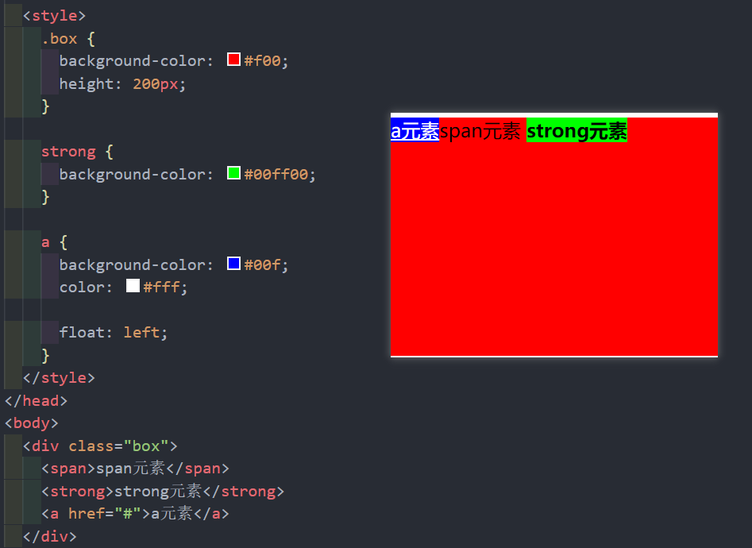

### 2.4 浮动规则二

* 浮动元素不能与行内级内容层叠, 行内级内容会被浮动元素推出
  * 比如: 行内级元素/inline-block元素/块级元素的文字内容

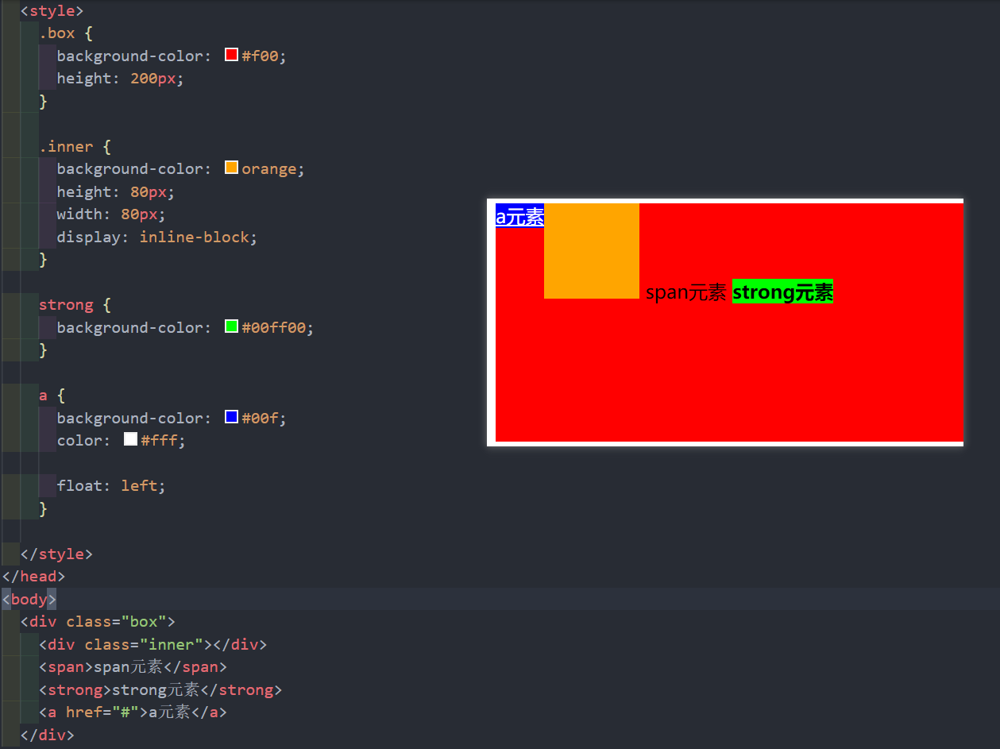

* 利用此特性, 可以实现文字环绕功能

### 2.5 浮动规则三

*  行内级元素/inline-block元素浮动后, 其顶部将与所在行的顶部对齐

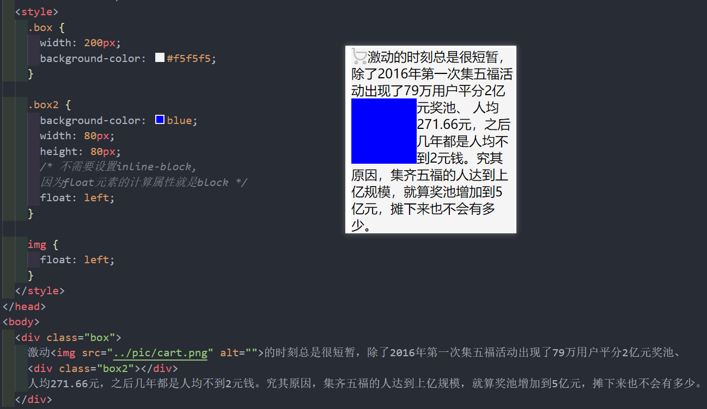

### 2.6 前三个规则融合

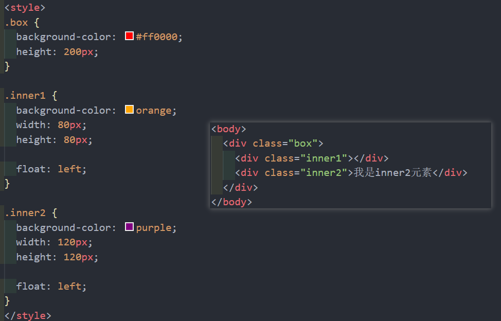

1) inner2 进行左/右浮动的时候, 只会在当前自己行中浮动

2) inner1 进行左浮动, inner2 没有浮动时

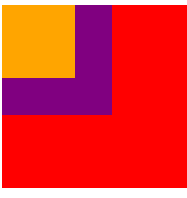

3) inner1 进行左浮动, inner2 左浮动时

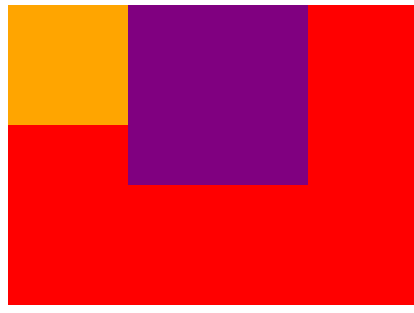

4) inner1 进行左浮动, inner2 没有浮动但有文字内容时

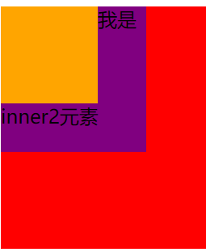

5) inner1 进行左浮动, inner2 左浮动且有文字内容时

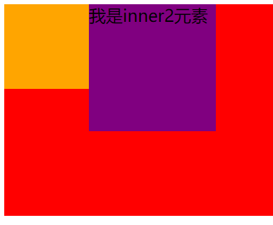

6) inner1和inner2都进行左浮动, 但父元素没有设置高度, 那么父元素高度会消失(高度的坍塌)

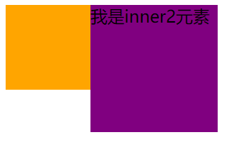

### 2.7 浮动规则四

* 如果元素是向左(右)浮动, 浮动元素的左(右)边界不能超出包含块的左(右)边界

### 2.8 浮动规则五

* 浮动元素之间不能层叠
  * 如果一个元素浮动, 另一个浮动元素已经在那个位置了, 后浮动的元素将紧贴着前一个浮动元素(左浮找左浮, 右浮找右浮)
  * 如果水平方向剩余的空间不够显示浮动元素, 浮动元素将向下移动, 直到有充足的空间为止

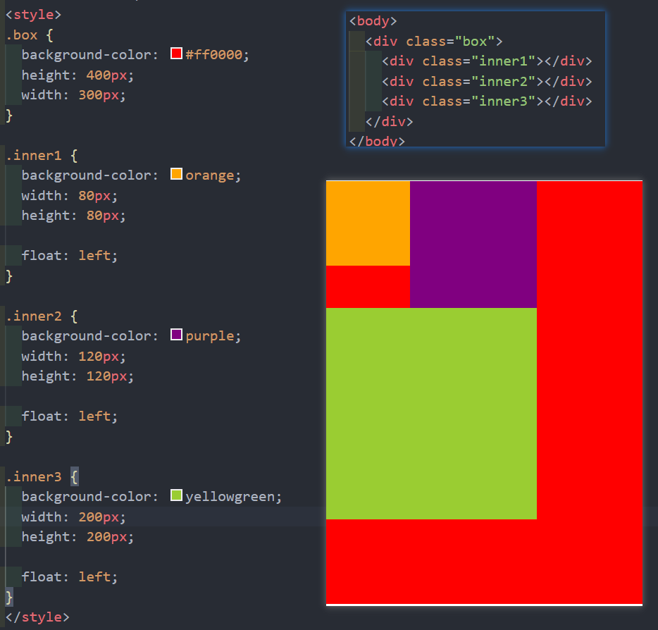

### 2.9 浮动规则六

* 浮动元素的顶端不能超过包含块的顶端, 也不能超过之前所有浮动元素的顶端

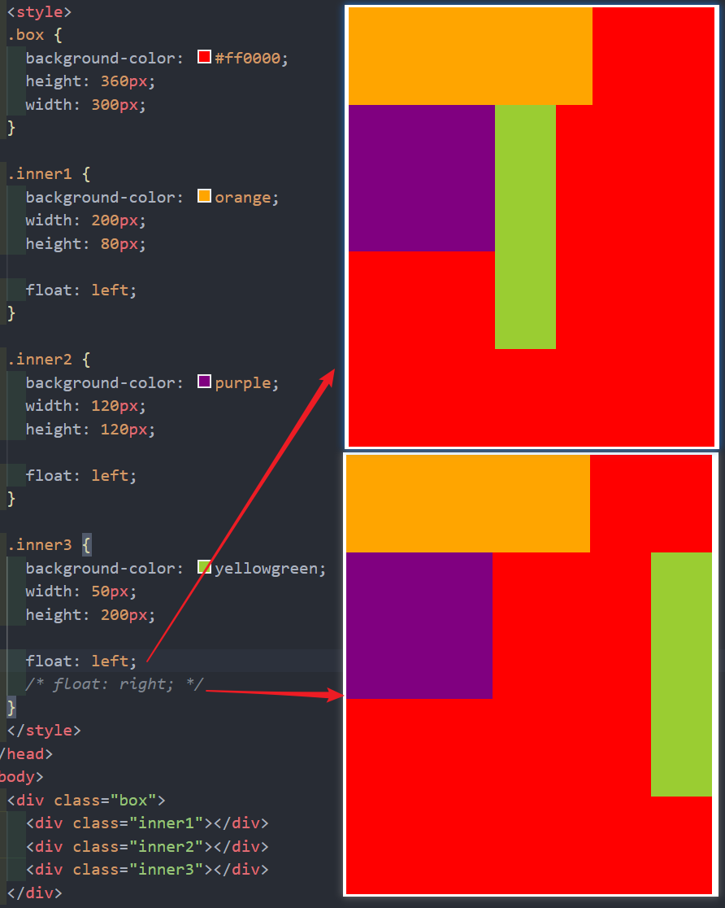