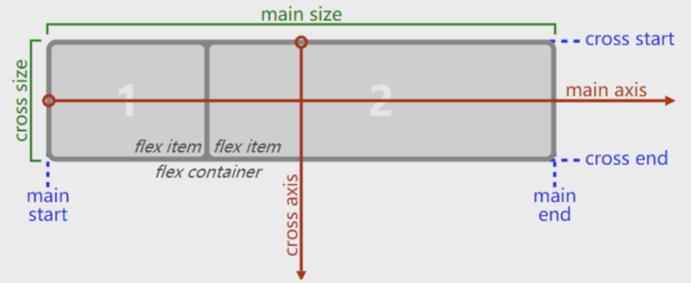
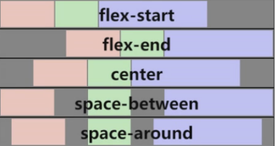
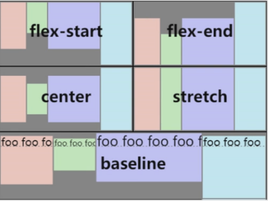

# 内容概述

## 1 认识flex布局

- flexible布局, 弹性布局
- 两个重要概念
  - 开启了flex布局的元素叫 flex container
  - flex container 里面的直接子元素叫 flex items
- 设置display属性为 flex 或 inline-flex 可以成为flex container
  - flex: flex container 以 block 形式存在
  - inline-flex: flex container 以 inline-level 形式存在

## 2 flex布局模型

## 3 flex 相关属性

### 3.1 应用在 flex container 上的属性

#### flex-direction

- flex items 默认都是沿着主轴(main axis)方向从 main start 开始往 main end 方向排布
- flex-direction 决定了 main axis 的方向, 有以下四个值:
  - row: 主轴从左至右, 默认值
  - row-reverse: 主轴从右至左
  - column: 主轴从上至下
  - column-reverse: 主轴从下至上

#### justify-content

- justify-content 决定了 flex items 在 main axis 上的对齐方式

  - flex-start: 与 main start 对齐, 默认值
  - flex-end: 与 main end 对齐
  - center: 居中对齐
  - space-between
    - flex items 之间的距离相等
    - 与 main start/main end 两端对齐

  - space-evenly
    - flex items 之间的距离相等
    - flex items 与 main start/main end 之间的距离等于 flex items 之间的距离

  - space-around
    - flex items 之间的距离相等
    - flex items 与 main start/main end 之间的距离是 flex items 之间距离的一半

  

#### align-items

- align-items 决定了 flex items 在 cross axis 上的对齐方式

  - normal: 在弹性布局中, 效果和stretch一样
  - stretch: 当 flex items 在 cross axis 方向的size为auto时, 会自动拉伸至填充flex container
  - flex-start: 与 cross start 对齐
  - flex-end: 与 cross end 对齐
  - center: 居中对齐
  - baseline: 基线对齐

  

#### 

#### flex-wrap

- flex-wrap 决定了flex container 是单行还是多行
  - nowrap: 单行, 默认值
  - wrap: 多行
  - wrap-reverse: 多行(对比wrap, cross start 与 cross end 相反)

#### flex-flow 

- flex-flow  是 flex-direction || flex-wrap 的缩写属性
- 顺序任意

#### align-content

- align-content 决定了 flex items 在 cross axis 上的对齐方式, 用法与justify-content类似

  - stretch: 与 align-items 的 stretch 类似, 默认值
  - flex-start: 与 cross start 对齐
  - flex-end: 与 cross end 对齐
  - center: 居中对齐
  - space-between
    - flex items 之间的距离相等
    - 与 cross start/cross end 两端对齐

  - space-evenly
    - flex items 之间的距离相等
    - flex items 与 cross start/cross end 之间的距离等于 flex items 之间的距离

  - space-around
    - flex items 之间的距离相等
    - flex items 与 cross start/cross end 之间的距离是 flex items 之间距离的一半

### 3.2 应用在 flex items 上的属性

#### order

- order 决定了 flex items 的排布顺序
  - 可以设置任意整数(正整数/0/负整数), 值越小排越前面
  - 默认值是0 

#### align-self

- flex items 可以通过align-self覆盖flex container设置的align-items
  - auto: 默认值, 遵从flex container 的 align-items设置
  - stretch/flex-start/flex-end/center/baseline, 效果和align-items一致

#### flex-grow

- flex-grow 决定了 flex items 如何扩展
  - 可以设置任意非负数字 (正小数/正整数/0), 默认值是 0
  - 当 flex container 在 main axis 方向有剩余size时, flex-grow 才会生效
- 如果所有 flex items 的 flex-grow 总和超过 1,每个 flex item 扩展的 size 为:
  - flex container 的剩余 size * flex-grow / sum
- 如果所有 flex items 的 flex-grow 总和不超过 1,每个 flex item 扩展的 size 为:
  - flex container 的剩余 size * flex-grow
- flex items 扩展后的最终size不能超过max-width/max-height

#### flex-shrink

- flex-grow 决定了 flex items 如何扩展

  - 可以设置任意非负数字 (正小数/正整数/0), 默认值是 1
  - 当 flex items 在 main axis 方向上超过了 flex container 的size时, flex-shrink 才会生效
- 如果所有 flex items 的 flex-shrink 总和超过 1,每个 flex item 收缩的 size 为:

  - flex items 超出的 size * flex-shrink / sum
- 如果所有 flex items 的 flex-shrink 总和不超过 1,每个 flex item 收缩的 size 为:

  - flex items 超出的 size * flex-shrink
- flex items 收缩后的最终size不能小于 min-width/min-height

#### flex-basis

- flex-basis 用来设置 flex items 在 main axis 方向上的 base size
  - auto, 默认值	
  - 具体的宽度数值(px)
- 决定 flex items 最终 base size 的因素, 从优先级高到低:
  - max-width/max-height/min-width/min-height
  - flex-basis
  - width/height
  - 内容本身的size

#### flex

- flex是 flex-grow || flex-shrink || flex-basis 的缩写属性

  